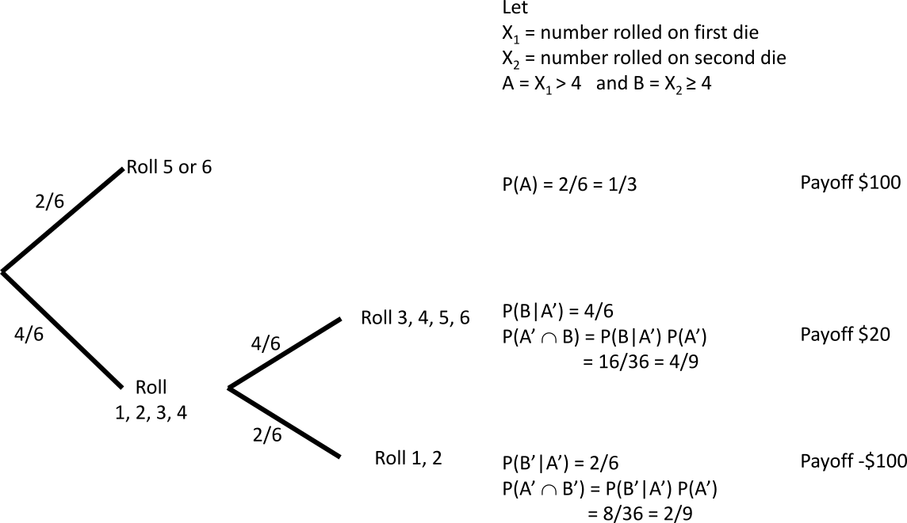

```{r setup, include=FALSE}
knitr::opts_chunk$set(include = TRUE) # change to TRUE when rendering solutions; this changes
                                      # the default visibility (which is overridden by explicitly
                                      # setting  include=TRUE in chunk options) 
```


### Question
A fuse is drawn at random from a box containing ten 3 amp, thirty 5
amp, twenty 10 amp and fifteen 13 amp fuses.  Find the probability
that the fuse selected is: 

* a 5-amp fuse, 
* more than 5 amps
* less than 13 amps

```{r}
10/(10+30+15)       # (a)
1-10/(10+30+15)     # (b)
(10+30)/(10+30+15)  # (c)
```
 
### Question
A fair coin is tossed six times.  What is the probability of the following outcomes?

* HHHHHH
* HHHHHT
* HTHHTH
* TTTTTT

```{r}
0.5^6
```

```{asis}
Each outcome has the same probability of $(1/2)^6$.
```

### Question
A family plans to have a picnic, but it will be cancelled if it is
rainy, or if cousin Barry is crook.  The weather reports that there is
a 23 percent chance of rain, and uncle Bill says that Barry will be
ill with probability one half.  What is the probability that the
picnic will be cancelled?  You may assume that Barry's health is
independent of the weather
  
```{asis}
Event A = rain, $P(A)=0.23$

Event B = Barry is ill, $P(B) = 0.5$

We seek $P(A\cup B)$

Because $A,B$ are independent, $p(A\cap B)=p(A)\times p(B)$.

From the principle of inclusion-exclusion we have

$P(A\cup B) = p(A) + p(B) - p(A\cap B) = 0.23 + 0.5 - 0.5*0.23$
```

```{r}
0.5 + 0.23 - 0.3*0.23
```

```{asis}
about 66\%
```

### Question

Consider the following game.  A fair 6 sided die is thrown.  If the
result is a number greater than 4 then the player receives
\$100. Otherwise, the die is thrown a second time.  If the result on
this second throw is 3 or more then the player gets \$20, otherwise the
player must pay \$100.

* Represent this game as an event tree

```{asis,label=treediagramlabel}

```

* Calculate the expected value of this game

```{asis}

$$
\sum_{i=1}^n x_iPr(X=X_i) = 100\times\frac{2}{6} + 20\times\frac{4}{9} + (-100)\times\frac{2}{9}
$$
```

```{r}
100*1/3 + 20*4/9 -100*2/9
```

### Question 

During the inaugural season of Major League Soccer in the United
States, the medical teams documented 256 injuries that caused a loss
of participation time to the player. The results of this
investigation, reported in the American Journal of Sports Medicine,
are shown in the table.


```{r,echo=TRUE, include=TRUE}
injuries <- matrix(c(66, 88, 23, 44, 12, 23), 3,2, byrow=TRUE)
dimnames(injuries) <- list(severity=c("Minor (A)", "Moderate (B)", "Major (C)"),
activity=c("Training (T)", "Game (G)"))
injuries
```

We can display this information more nicely using `kable`:

```{r,echo=FALSE, include=TRUE,results='asis'}
library(knitr)
kable(injuries)
```

If one individual is drawn at random from this group of 256 soccer
players, find the following probabilities by first writing out the
relevant formula and then computing it using R.

* Probability of an injury being at a game (rather than at training)
```{asis}
$p(G)$
```
```{r}
(n <- sum(injuries))
sum(injuries[,1])/n
```

* Probability that a minor injury was during training

```{asis}
$$p(T|A) = \frac{p(T\cap A)}{p(A)}$$
```

```{r}
(injuries[1,1]/n)   / (sum(injuries[1,])/n)


# alternatively
66/(66+88)
```

* Probability that an injury was minor, and during a game

```{asis}
$$p(A\cap G)$$
```

```{r}
injuries[1,2]/n
```

* Probability that a training injury was major

```{asis}
$$p(C|G) = \frac{p(C\cap G)}{p(G)}$$
```

```{r}
(injuries[3,1]/n) / (sum(injuries[,1])/n)

# alternatively
12/(66+23+12)
```


